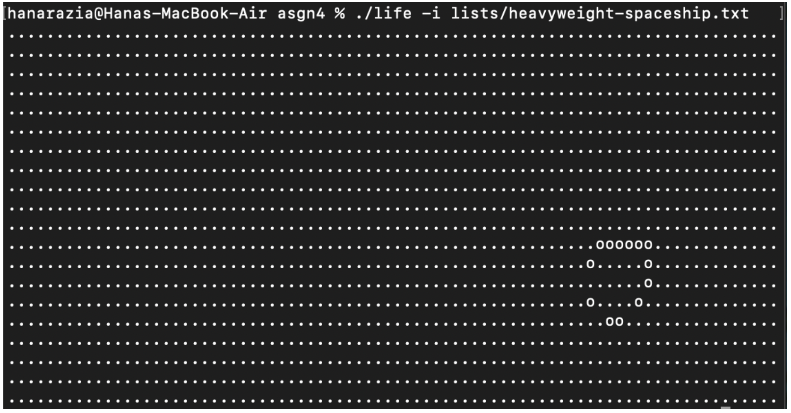

# The Game of Life (C)

The program implements Conway’s Game of Life through the use of an ADT (abstract data type) and the ncurses library. A grid is created on which the rules of the game are enforced creating either live or dead cells. 

## How to Run Locally (Requires: C Compiler, nscurses)

1. Clone the repo  
  ```bash
  git clone https://github.com/yourusername/game-of-life.git
  cd game-of-life
  ```
2. Build the project
  ```
  make
  ```
3. Run the program with desired flags
  ```
  ./life -t	Makes toroidal Universe
  ./life -s	Silences ncurses
  ./life -n	Sets number of generations to input
  ./life -i	Sets input file to input
  ./life -o	Sets output file to output
  ./life -H	Prints out program usage
  ```
  Example:
  ```
  ./life -t -n 100 -i list/beehive.txt -o output.txt
  ```

---

## Files in Repo

| File            | Description                                                                                         |
|-----------------|-----------------------------------------------------------------------------------------------------|
| `universe.c`    | Implements the Universe ADT                                                                         |
| `universe.h`    | Header file that specifies the interface to `universe.c`                                            |
| `life.c`        | Contains the `main` function to run Conway’s Game of Life                                           |
| `Makefile`      | Compiles the program using `clang` and applies `clang-format` to all source files                   |
| `lists/`        | Folder containing `.txt` pattern files (e.g., `glider.txt`, `beehive.txt`) for input configurations |



